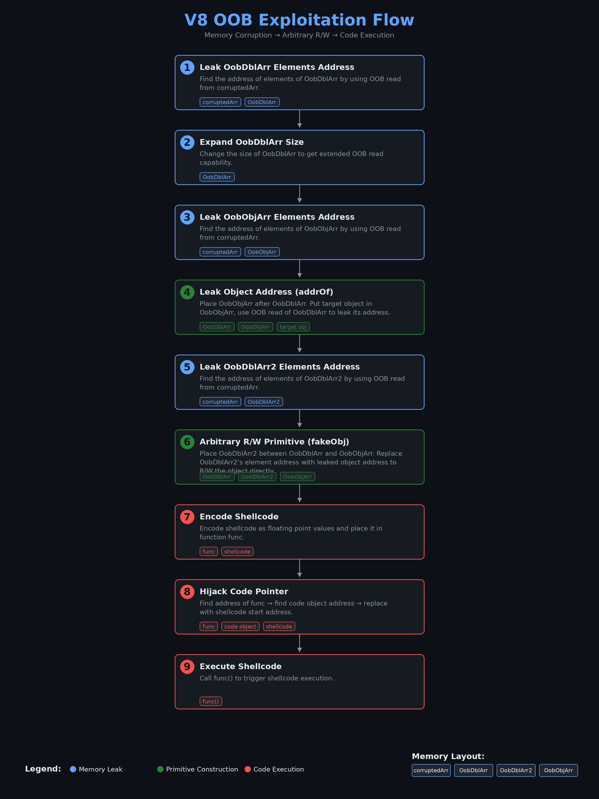

This blog contains detailed analysis of the exploit of CVE-2023-4069 provided by **man yue mo** of github security lab. The vulnerability analysis has been skipped because it is already well explained in the [Getting RCE in Chrome with incomplete object initialization in the Maglev compiler](https://web.archive.org/web/20250127220944/https://github.blog/security/vulnerability-research/getting-rce-in-chrome-with-incomplete-object-initialization-in-the-maglev-compiler/). Being new to browser exploitation, I had trouble understanding the exploit so I decided to make a writeup to organize my thoughts as well as be of help to others.

# Analysing Exploit of CVE-2023-4069

## Exploit Strategy

The exploit can be found [here](https://github.com/github/securitylab/blob/main/SecurityExploits/Chrome/v8/CVE_2023_4069/poc.js).

The vulnerability gives us OOB read/write. Below are the steps that will be followed in the exploit to spawn a shell. Each step will be discussed in detail later.

