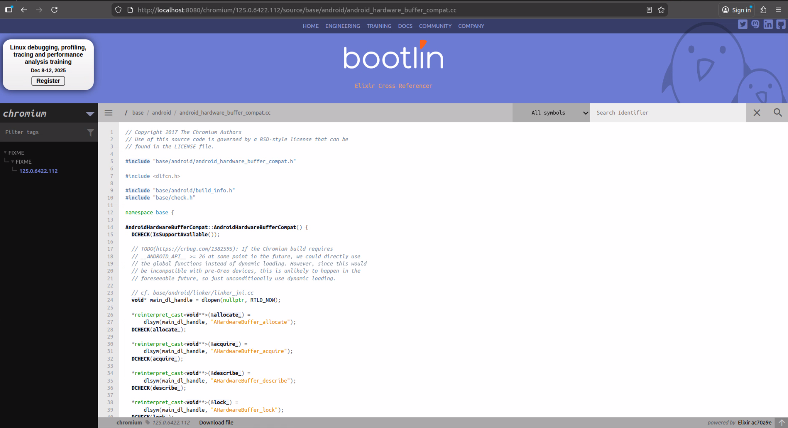

In this post we will see how we can set up the chromium source code in elixir bootlin. [Chromium Code Search](https://source.chromium.org/chromium/chromium/src) is good but it has some limitations like it cannot show references for older versions or whenever you search for a function in the search bar, the new function always opens in the `main` branch and you have to manually go back to older version. Now, the search method can be worked with but no references on older version can make code auditing really slow and frustrating. These are the reasons that lead me to look for alternatives and try the elixir cross referencer.
# What is elixir Cross Referencer?

Elixir is a source code cross-referencer inspired by [LXR](https://en.wikipedia.org/wiki/LXR_Cross_Referencer). It’s written in Python and its main purpose is to index every release of a C or C++ project (like the Linux kernel) while keeping a minimal footprint.

It uses Git as a source-code file store and Berkeley DB for cross-reference data. Internally, it indexes Git _blobs_ rather than trees of files to avoid duplicating work and data. It has a straightforward data structure (reminiscent of older LXR releases) to keep queries simple and fast.

# Setup 

We will be using the `Manual Installation` method for installation of elixir bootlin.

## Install dependencies

```bash
# For Debian
sudo apt install python3-pip python3-venv libdb-dev python3-dev build-essential universal-ctags perl git apache2 libapache2-mod-wsgi-py3 libjansson4
```

## Clone Elixir

```bash
git clone https://github.com/bootlin/elixir.git /usr/local/elixir/
```

## Create a virtual env

```bash
python -m venv /usr/local/elixir/venv
. /usr/local/elixir/venv/bin/activate
pip install -r /usr/local/elixir/requirements.txt
```

## Create directories for project data

```bash
mkdir -p /home/linux/elixir-data/chromium/repo
mkdir -p /home/linux/elixir-data/chromium/data
```

## Set env variables

We need to see 2 env variables that give indication about where the cloned repo is present and where the database created will be stored for the given source code.

- `LXR_REPO_DIR` (the git repository directory for your project)
- `LXR_DATA_DIR` (the database directory for your project)

Next, add these variables to `etc/profile` and run command `source /etc/profile`.

```txt
export LXR_REPO_DIR=/home/linux/elixir-data/chromium/repo
export LXR_DATA_DIR=/home/linux/elixir-data/chromium/data
```

## Clone chromium source

Clone the chromium source code using the commands:

```bash
cd /home/linux/elixir-data/chromium
git clone --bare https://chromium.googlesource.com/chromium/src repo
```

The chromium source along with all the third party libraries and dependencies is about `57.8 GB` in size. So, it will take a few hours depending on your internet connection.

## Testing

For testing we will see whether the project is correctly picked up by elixir and the env variables are correct. 

```bash
cd /usr/local/elixir/
./script.sh list-tags
```

```bash
linux@linux:/usr/local/elixir$ source /etc/profile
linux@linux:/usr/local/elixir$ ./script.sh list-tags
3.0.195.25
3.0.195.27
3.0.195.33
3.0.195.36
3.0.195.37
3.0.195.38
4.0.212.1
4.0.221.8
...
...
```

## Specifying tags

Now, before creating database, I think it is very crucial that we decide on the version we want to work on and only build that, as generating full database takes tens of hours as told in official documentation:

```txt
Generating the full database can take a long time: it takes about 15 hours on a Xeon E3-1245 v5 to index 1800 tags in the Linux kernel. For that reason, you may want to tweak the script (for example, by limiting the number of tags with a "head") in order to test the update and query commands. You can even create a new Git repository and just create one tag instead of using the official kernel repository which is very large.
```

The chromium code might end up taking a lot more time than the linux kernel. So, now let's specify a version to generate database for. 

In the `/usr/local/elixir/projects` directory make a file by name of project specified in `/home/linux/elixir-data` as `<project.sh>` or in our case `chromium.sh` and paste the following text:

```txt
list_tags()
{
    echo "125.0.6422.112"
}
```

Now if we run `./script.sh` we get only 1 tag version:

```bash
linux@linux:/usr/local/elixir$ vim projects/chromium.sh
linux@linux:/usr/local/elixir$ ./script.sh list-tags
125.0.6422.112
linux@linux:/usr/local/elixir$
```

## Create database

Now, we can create the database for only 1 version. 

```bash
. ./venv/bin/activate
./update.py <number of threads>
```

On my server with 30 treads it still took more than 3 hours just for one tag. This will create a lot of `*.db` files in `/home/linux/elixir-data/chromium/data` directory.

## Testing database generation

We now query into the databases generated and see if everything works out fine.

```bash
linux@linux:/usr/local/elixir$ python3 -m utils.query ident 125.0.6422.112 AcceptParcel C

Symbol Definitions:
Symbol in path: third_party/ipcz/src/ipcz/local_router_link.h, line: 44 , type: prototype
Symbol in path: third_party/ipcz/src/ipcz/remote_router_link.h, line: 64 , type: prototype
Symbol in path: third_party/ipcz/src/ipcz/router_link.h, line: 73 , type: prototype
Symbol in path: third_party/ipcz/src/ipcz/local_router_link.cc, line: 124 , type: function
Symbol in path: third_party/ipcz/src/ipcz/remote_router_link.cc, line: 141 , type: function

Symbol References:
Symbol in path: third_party/ipcz/src/ipcz/node_link.cc, line: 537
Symbol in path: third_party/ipcz/src/ipcz/node_link.h, line: 255
Symbol in path: third_party/ipcz/src/ipcz/node_messages_generator.h, line: 357
Symbol in path: third_party/ipcz/src/ipcz/remote_router_link.cc, line: 145,221
Symbol in path: third_party/ipcz/src/ipcz/router.cc, line: 200,1559

Documented in:
linux@linux:/usr/local/elixir$
```

```bash
linux@linux:/usr/local/elixir$ python3 -m utils.query file 125.0.6422.112 /third_party/ipcz/src/ipcz/node_link.h

// Copyright 2022 The Chromium Authors
// Use of this source code is governed by a BSD-style license that can be
// found in the LICENSE file.

#ifndef IPCZ_SRC_IPCZ_NODE_LINK_H_
#define IPCZ_SRC_IPCZ_NODE_LINK_H_

#include <atomic>
#include <cstddef>
#include <cstdint>
#include <optional>
#include <type_traits>
#include <vector>

#include "ipcz/driver_memory.h"
#include "ipcz/driver_transport.h"
#include "ipcz/features.h"
```

As we can see above the database generation was a success. Now, the only step remaining is setting up the http server.

## Setting up HTTPd

We need to set a new env variable that points to the top level directory containing all the projects as the web server includes support for multiple projects to be indexed. In `/etc/project` add a new line:

```txt
export LXR_PROJ_DIR=/home/linux/elixir-data
```

Next replace `/etc/apache2/sites-enabled/000-default.conf` with `/usr/local/elixir/docker/000-default.conf`.  We need to make few changes to `docker/000-default.conf` though. 

```txt
linux@linux:/usr/local/elixir$ cat /etc/apache2/sites-enabled/000-default.conf 

<Directory /usr/local/elixir/>
    AllowOverride None
    Require all denied
    <FilesMatch "wsgi.py">
        Require all granted
    </FilesMatch>
</Directory>
<Directory /usr/local/elixir/static/>
    AllowOverride None
    Require all granted
</Directory>

# Changed port to 8080 as port 80 was being used already
<VirtualHost *:8080> 
    ServerName 127.0.0.1
    DocumentRoot /usr/local/elixir/

# Set the LXR_PROJ_DIR accordingly
    SetEnv LXR_PROJ_DIR /home/linux/elixir-data/
    # restart-interval is 12 hours
    WSGIDaemonProcess Elixir processes=16 threads=1 \
        display-name=%{GROUP} restart-interval=43200 \
        home=/usr/local/elixir/ python-home=/usr/local/elixir/venv/
    WSGIApplicationGroup %{GLOBAL}

    WSGIProcessGroup Elixir
    WSGIScriptAliasMatch "^/(?!static/)" /usr/local/elixir/wsgi.py/$1

    AllowEncodedSlashes On
    RewriteEngine on
    
# Changed linux to your project name. In my case it is chromium
    RewriteRule "^/$" "/chromium/latest/source" [R]
    RewriteRule "^/robots.txt$" "/static/robots.txt" [L]
    RewriteRule "^/favicon.ico$" "/static/img/favicon.ico" [L]
</VirtualHost>
```

We also need to change some permission for `apache` to work:

```bash
sudo chown -R www-data:www-data /usr/local/elixir
sudo chown -R www-data:www-data /home/linux/elixir-data
sudo chmod -R 755 /usr/local/elixir
sudo chmod -R 755 /home/linux/elixir-data
```

After this restart the http server:

```bash
sudo systemctl restart apache2.service
```

## Opening source code

Go to the browser and type:

```txt
http://localhost:8080/
```

We will see the following:

